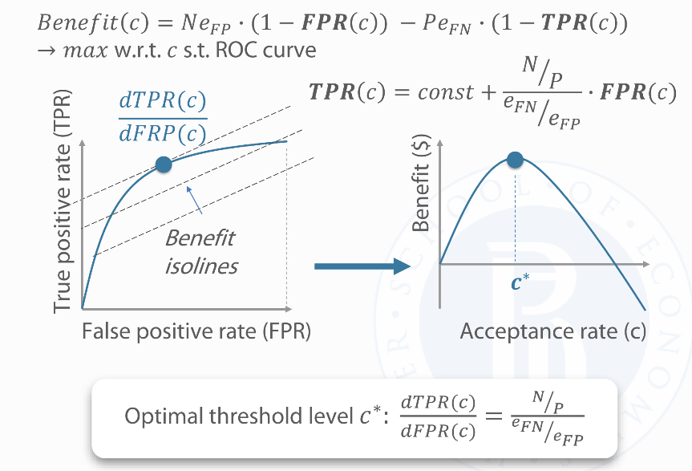

# Performance evaluation

## Glossary

Confusion matrix: a matrix of true vs predicted values. Off-diagonal observations are errors

## Metrics

Accuracy: $\frac{TP+TN}{TP+FP+TN+FN}$

Precision: $\frac{TP}{TP+FP}$

Recall: $\frac{TP}{TP+FN}$

$F_{\beta}$ score: $(1+\beta^2)*\frac{precision \cdot recall}{(\beta^2 \cdot precision)+recall}$. If $\beta=1$, then $F_1$ is the harmonic mean between precision and recall. ([wiki](https://en.wikipedia.org/wiki/F-score))

ROC: plot of the TP (y) vs FP (x)

AUC: area under ROC curve

### Considerations

Both $F_{\beta}$ and AUC do not take into account TN, which helps when there is class imbalance.

If you are more interested in one of te classes (that is, TP is higher valued than TN), use $F_{\beta}$.

If you are interested in all classes, use ROC and AUC.

## Performance drift

### Concepts

- Data drift - $P(X)$ 
    - Label schema change - $Y$: new classes, outdated classes, finer-grained classes
- Model drift - $P(Y|X): same inputs yield different output
    - Feature drift: a subset of features becomes, or ceases to be, relevant to the learning task

### Mitigation strategies

- Periodic retraining
- Online learning

## Financial benefit of ML

For a binary classification:

$Benefit = (N - FP)*Error_1 - (FN*Error_2)$

For example, in a loan use case, the error of type 1 is the forgone gain from issuing a loan; the type 2 error is the loss given default.

Find the best acceptance threshold ($\alpha$)by computing the expected benefit for all $\alpha$.

Sometimes it's easier andnmore efficient to improve the decision strategy than the model itself.

You can also find the best $alpha$ by solving the constrained maximization problem as in the figure below.

### Model risk

Sources:
- model decay
- ignoring the better challenger model
- sub-optimal model implementation ($\alpha$)