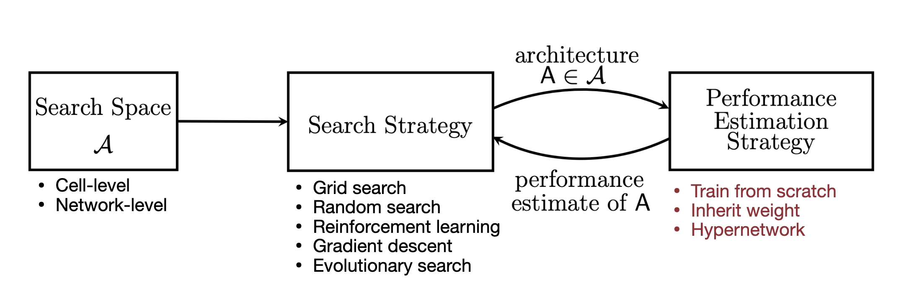

# TiniML and Efficient Deep Learning Computing

## Overview

### Layers

| Layer           | Inputs               | Outputs              | Weights                   |
| --------------- | -------------------- | -------------------- | ------------------------- |
| Fully connected | $(n, c_i)$           | $(n, c_o)$           | $W: (c_o, c_i)$           |
| 1D Convolution  | $(n, c_i, w_i)$      | $(n, c_o, w_o)$      | $W: (c_o, c_i, k_w)$      |
| 2D Convolution  | $(n, c_i, w_i, h_i)$ | $(n, c_o, w_o, h_o)$ | $W: (c_o, c_i, k_w, k_h)$ |
| Pooling         |                      |                      | N/D                       |
| Normalization   |                      |                      | $\mu, \sigma$             |
| Activation      |                      |                      |                           |

### Convolution layer

Receptive field increases with the number of layers: $L \cdot (k-1) + 1$

Output size: $o_w = \frac{i_w + 2*{padding}_w - k_w}{stride} + 1$

_Grouped convolution_: uses multiple kernels for each group of channels. For $g$
groups, the number of parameters is reduced by g.

_Depth-wise convolution_: grouped convolution in which the number of groups is the
same as the number of channels

## Efficiency metrics

Memory:

- number of parameters
- model size: num parameters x bit width
- total / peak number of activations

Computation:

- MAC (multiply and aggregate)
  - Matrix multiplication: ($A: (m, n), B: (n, k)$) m x n x k MACs
- FLOP
- FLOPS
- OP
- OPS

Time:

- latency
  - how much time it takes to complete a task
  - can be reduced overlapping data movement and computation operations
- throughput: the rate at which data is processed

Greater filter sizes increase the number of parameters, but reduce the

## Pruning and Sparsity

### Granularities

For convolutional layers:

- fine-grained
- pattern-based
- vector-level
- kernel-level
- channel-level

### Criteria

- Magnitude ($L1$ / $L2$ / $L_p$)
- Scaling
- Second-order
- Percentage-of-zero
- Regression-based: minimize reconstruction error of the corresponding layer's
  output

### How to choose the pruning ratio

- Analyze the sensitivity of pruning each layer to the model accuracy
- NetAdapt: iteratively find the per-layer pruning ratio to meet a global
  resource constraing (e.g. latency, energy, ...)

### Finetuning pruned models

- Learning rate is 10%-1% of the origiral learning rate
- When doing iterative pruning
  - each pruning stage is followed by a FT stage
  - Add regularization (L1, L2) to penalize non-zero parameters or encourage
    smaller parameters
- Iterative magnitude pruning (lottery ticket hypothesis)

### Resources

**Tutorials**

- [Torch Pruning Tutorial](https://pytorch.org/tutorials/intermediate/pruning_tutorial.html)
- [Deepgram Pruning Tutorial](https://deepgram.com/learn/model-pruning-distillation-and-quantization-part-1)

**Libraries**

- [Intel Neural Compressor](https://github.com/intel/neural-compressor)
- [MIT AMC](https://github.com/mit-han-lab/amc)
- [Torch Pruning](https://github.com/VainF/Torch-Pruning)

## Quantization

### Data Types

| Data Type  | Exponent (bits) | Fraction (bits) | Total (bits) |
| ---------- | --------------- | --------------- | ------------ |
| FP32       | 8               | 23              | 32           |
| FP16       | 5               | 10              | 16           |
| BF16       | 8               | 7               | 16           |
| FP8 (E4M3) | 4               | 3               | 8            |
| FP8 (E5M2) | 5               | 2               | 8            |

Exponent bits are important for (dynamic) **range**, and dynamic range is
important for training.

Fraction bits affect the representation **precision**

### Quantization Approaches

| Approaches                  | Storage                      | Computation     |
| --------------------------- | ---------------------------- | --------------- |
| Naive                       | FP weights                   | FP arithmetic   |
| K-means                     | INT weights, FP codebook     | FP arithmetic   |
| K-means w/ Huffman Encoding | Codebook uses Huff. Enc.     |                 |
| Linear                      | INT weights, linearly spaced | INT arithmetics |
| Binary / Ternary            |                              |                 |

Linear quantization is an affine mapping of integers to real numbers:
$w_{fp} = scale_{fp}(quant_{int}-offset_{int})$

### Post-Training Quantization (PTQ)

**Zero Point**

- Asymmetric
- Symmetric

**Quantization Granularity**

- Per-Tensor
- Per-Channel
- Group Quantization

**Dynamic Range Clipping**

- Exponential moving average
- Minimizing KL divergence
- Minimizing MSE

**Rounding**

- Round to nearest
- AdaRound

### Quantization-Aware Training (QAT)

### Resources

- [Torch Dynamic Quantization Tutorial](https://pytorch.org/tutorials/advanced/dynamic_quantization_tutorial.html)

**Papers**

- [Deep Compression](https://arxiv.org/abs/1510.00149)

## Neural Architecture search

### Layers

- Depthwise-convolution
  - extreme case of group convolution where the group number equals the number
    of input channels
  - captures spatial information
- 1x1 Convolution
  - fuse/exchange information across channels

### Blocks

- Inverted bottleneck (MobileNetV2)
  - expands the number of channels
  - improves capacity of depthwise convolution
  - allows depthwise conv. for parameter reduction, but
    increases peak activation
- 1x1 group convolution & channel shuffle (ShuffleNet)
  - higher cost reduction than inverted bottleneck
  - exchange info across groups via channel shuffle
- Multi-Head (Self) Attention

### NAS

Search space

- cell-level
  - input: previous and previous-previous layer output
  - transformation (conv2D, maxpool)
  - combine method (add, multiply)
- network-level:
  - depth
  - resolution
  - kernel size
  - width

Search Strategy

- grid search
- random search
- reinforcement learning
- gradient descent
- evolutionary search

Performance estimation strategy

- Train from scratch
  - prohibitive training cost
- Inherit weight (Net2Net)
  - inherit weights from a parent model to reduce the training cost
    instead of training from scratch
  - Generate network transformation actions to update the model
    architecture instead of directly generating the model architecture
- Hypernetwork (SMASH)
  - At each training step, a random model architecture is sampled from
    the search space
  - The hyper-network generated weights based on the model architecturee
  - Use gradient descent to update the weights of the hyper-network
- Zero-shot NAS (ZenNAS, GradSign)

## Knowledge Distillation
